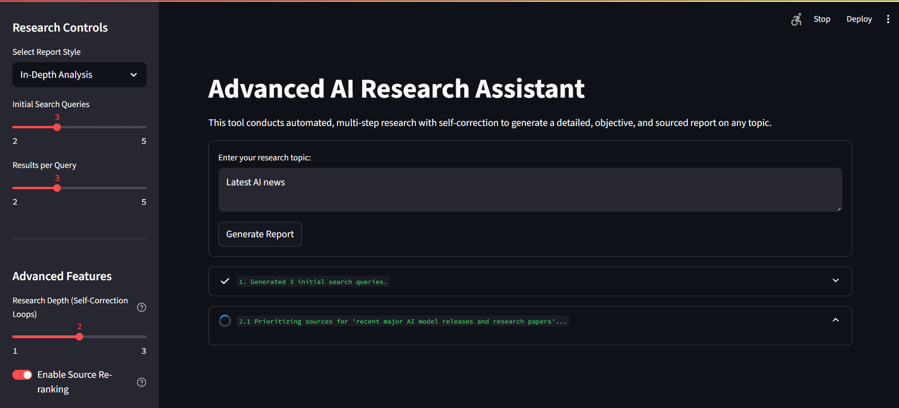

# AI Research Assistant

An intelligent, multi-step AI agent that conducts automated research, performs self-correction, and generates detailed, objective, and sourced reports on any given topic.



## 🚀 Features

* **Autonomous Research Agent:** Simply provide a topic, and the AI handles the entire research workflow.
* **Multi-Step Process:** The agent intelligently generates search queries, scrapes web content, and summarizes sources before writing the final report.
* **Recursive Self-Correction:** The AI can review its own research to identify knowledge gaps and automatically run new searches to create a more comprehensive report.
* **Source Re-ranking:** Utilizes an LLM to prioritize and re-rank search results based on their relevance to the query, ensuring only the highest-quality information is used.
* **Customizable Reports:** Choose from different report styles, from a concise summary to an in-depth analysis.
* **Sourced and Verifiable:** The final report includes a "References" section, and the UI provides a detailed breakdown of all sources used for each research query.
* **PDF Export:** Download the final, professionally formatted report as a PDF document.
* **Interactive UI:** Built with Streamlit for a clean, user-friendly, and responsive experience.

## 🤔 How It Works

The application follows a sophisticated, agent-like workflow orchestrated by LangChain:

1.  **Query Generation:** Based on the user's input topic, the AI first brainstorms a set of diverse and objective search queries to form a solid research foundation.
2.  **Web Search & Re-ranking:** It performs a web search for each query. If enabled, it then uses a second AI call to analyze the search results (titles and snippets) and re-rank them based on their relevance to the original query. This critical step prioritizes the most promising sources.
3.  **Scraping & Summarization:** The agent scrapes the content from the top-ranked URLs. For each source, it generates a concise summary that directly addresses the initial research query.
4.  **Self-Correction Loop (Recursive Analysis):** After the initial research pass, the agent analyzes all the collected summaries to identify any unanswered questions, conflicting information, or gaps in its understanding. If it finds any, it generates a new set of more specific queries and repeats the research process to deepen its knowledge. This loop can be configured to run multiple times for more thorough research.
5.  **Report Synthesis:** Finally, the AI aggregates all the verified and summarized information. It then prompts a final, powerful LLM instance (acting as a critical thinker) to write a well-structured, objective, and fully-sourced report in APA format.

## 🛠️ How to Run

Follow these steps to set up and run the project locally.

### Prerequisites

* Python 3.8+
* A Google AI API Key

### 1. Clone the Repository

```bash
git clone [https://github.com/madhyala-bharadwaj/AI-research-assistant.git](https://github.com/madhyala-bharadwaj/AI-research-assistant.git)
cd AI-research-assistant
```

### 2. Prepare Your Files

* Rename your main Python script to `main.py`.
* Place your screenshot in this directory and rename it to `app-screenshot.png`.

### 3. Create a Virtual Environment

It's recommended to use a virtual environment to manage dependencies.

```bash
python -m venv venv
source venv/bin/activate  # On Windows, use `venv\Scripts\activate`
```

### 4. Install Dependencies

Create a `requirements.txt` file in the project folder with the content provided below and run:

```bash
pip install -r requirements.txt
```

### 5. Set Up Environment Variables

Create a `.env` file in the root of your project directory and add your Google AI API key:

```
GOOGLE_API_KEY="YOUR_API_KEY_HERE"
```

### 6. Run the Streamlit App

Run the following command in your terminal:

```bash
streamlit run main.py
```

The application should now be open and running in your web browser!

---

